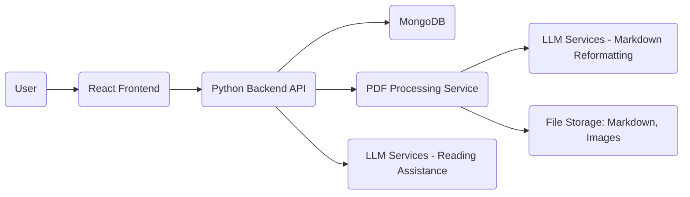

# Reading Pal Application: Architecture Document

**1. Overview**

The Reading Pal application is a web-based platform designed to enhance the reading experience of PDF documents by integrating Large Language Model (LLM) capabilities. It features a dual-pane interface for synchronized reading and note-taking, leveraging a separate PDF processing service and interacting with various LLM providers.

**2. High-Level Architecture**

The system follows a microservice-oriented approach, primarily consisting of:

*   **Frontend:** A React application providing the user interface.
*   **Backend:** A Python application serving as the API gateway and orchestrating interactions between the Frontend, Database, PDF Service, and LLM Services.
*   **PDF Service:** A separate Python service responsible for processing PDF files into Markdown and extracting images.
*   **LLM Services:** External or internal services providing LLM capabilities (summarization, Q&A, etc.).
*   **Database:** A MongoDB instance used for storing user data, notes, and book metadata.

*Note: The diagram shows two interactions with LLM Services to highlight the distinct purposes found in the code.*

**3. Component Details**

*   **Frontend (React):**
    *   Handles user interaction, rendering the UI.
    *   Displays processed book content (Markdown, Images).
    *   Provides the dual-pane view for book and notes.
    *   Manages synchronized scrolling between panes.
    *   Allows users to input notes and LLM prompts.
    *   Communicates with the Backend via REST APIs.
*   **Backend (Python):**
    *   Acts as the central hub.
    *   Manages user authentication (if implemented later).
    *   Receives PDF uploads from the Frontend.
    *   **Forwards the PDF file upload request to the PDF Service.**
    *   Receives processed data (Markdown content string, server-side image paths) from the PDF Service.
    *   Stores book metadata, the received Markdown content, and image paths in MongoDB.
    *   **Implements a static file server route to serve images from the `IMAGES_PATH` directory.**
    *   Provides APIs for the Frontend to:
        *   Upload PDFs.
        *   Fetch book content and metadata (including image URLs derived from server-side paths).
        *   Fetch/Save/Update notes.
        *   Send prompts to LLM Services for reading assistance.
    *   Communicates with LLM Services (configured via `.env`) for reading assistance tasks (summaries, Q&A).
    *   Retrieves LLM responses and potentially stores them or sends them to the Frontend.
*   **PDF Service (Python - FastAPI):**
    *   A standalone FastAPI service.
    *   Receives PDF files via a `/process-pdf` endpoint (`UploadFile`).
    *   Saves the uploaded PDF temporarily to `PDF_STORAGE_PATH`.
    *   Uses the `magic_pdf` library (`OCRPipe`) to process the PDF, extract text, and identify images.
    *   Extracts images and saves them to the configured `IMAGES_PATH`.
    *   Generates initial Markdown content.
    *   **Uses an LLM (Anthropic Claude, configured via `ANTHROPIC_API_KEY`) specifically to reformat the generated Markdown text for readability.**
    *   Saves the final reformatted Markdown content to the configured `MARKDOWN_PATH`.
    *   Cleans up the temporary input PDF file.
    *   Returns the reformatted Markdown content (as a string), server-side paths to saved images, and other metadata in a JSON response.
    *   Requires access to specific, configured absolute file storage paths (`PDF_STORAGE_PATH`, `MARKDOWN_PATH`, `IMAGES_PATH`).
*   **LLM Services:**
    *   **Reading Assistance LLMs:** External APIs (Anthropic, DeepSeek, Gemini) or local services (Ollama) as configured in `.env` (`LLM_SERVICE`, `LLM_MODEL`). Used by the **Backend** for user-initiated tasks like summarization and Q&A.
    *   **Markdown Reformatting LLM:** Anthropic Claude, configured via `ANTHROPIC_API_KEY`. Used *internally* by the **PDF Service** during the processing pipeline.
    *   Receive prompts and relevant context (book passages) from the component interacting with them.
    *   Return generated text.
*   **Database (MongoDB):**
    *   Stores structured and unstructured data.
    *   Primary data entities:
        *   Books (metadata: title, original filename, processed status, **the full processed Markdown content string**, **list of server-side image paths**).
        *   Notes (content, timestamp, reference to book section/page, link to LLM interaction if applicable).
        *   Users (if authentication is added).

**4. Data Flow Examples**

*   **PDF Upload & Processing:**
    1.  User uploads PDF via Frontend.
    2.  Frontend sends PDF file to Backend API (`POST /upload-pdf`).
    3.  **Backend forwards the PDF file content as an `UploadFile` to the PDF Service API (`POST /process-pdf`).**
    4.  PDF Service receives the file, saves it temporarily, processes it using `magic_pdf`, extracts/saves images, generates Markdown, **reformats Markdown using Claude**, saves Markdown, and cleans up the temporary file.
    5.  PDF Service returns the Markdown content string and server-side image paths to the Backend.
    6.  Backend saves book metadata, the received Markdown string, and the list of server-side image paths in MongoDB.
    7.  Backend signals Frontend that processing is complete and provides book ID.
    8.  Frontend fetches book content from Backend API (`GET /book/{book_id}`).
    9.  Backend retrieves Markdown string and image paths from MongoDB, **converts image paths to public URLs** (e.g., `/images/{filename}`), and returns them to the Frontend.
    10. Frontend displays the Markdown content, using the provided image URLs to fetch images from the Backend's static file server route.
*   **LLM Interaction (e.g., Summarize Passage):**
    1.  User selects text in the book pane and clicks "Summarize" in the Frontend.
    2.  Frontend sends the selected text and book context (book ID, section) to Backend API (`POST /llm/summarize`).
    3.  Backend retrieves necessary context (surrounding text) from the stored Markdown in MongoDB.
    4.  Backend calls the appropriate **Reading Assistance LLM Service** API with the prompt and context.
    5.  LLM Service processes the request and returns a summary.
    6.  Backend receives the summary.
    7.  Backend can optionally save the interaction/summary as a special type of note in MongoDB.
    8.  Backend sends the summary back to the Frontend.
    9.  Frontend displays the summary (e.g., in the notes pane).

**5. Technology Stack**

*   **Frontend:** React, HTML, CSS/JavaScript
*   **Backend:** Python (e.g., FastAPI or Flask), Requests library, PyMongo (MongoDB driver), Static file serving capability
*   **PDF Service:** Python (FastAPI), `magic_pdf`, Anthropic client library
*   **Database:** MongoDB
*   **Configuration:** `.env` files

**6. Key Considerations**

*   **File Storage & Serving:** The PDF Service saves files to specific absolute paths (`PDF_STORAGE_PATH`, `MARKDOWN_PATH`, `IMAGES_PATH`). The Backend *must* have access to `IMAGES_PATH` to serve these files statically to the Frontend. The Backend is responsible for mapping the server-side paths returned by the PDF Service to public URLs.
*   **Dual LLM Usage:** Be mindful of the two distinct uses of LLMs: one within the PDF Service for internal reformatting, and one orchestrated by the Backend for user-facing reading assistance. They may use different providers/models.
*   **PDF Service Communication:** The Backend needs to correctly format the request to the PDF Service's `/process-pdf` endpoint, including sending the file data.
*   **Synchronization:** Implementing smooth and accurate synchronized scrolling between potentially different content types (Markdown vs. editable notes) is crucial.
*   **Scalability:** Consider potential bottlenecks, especially in PDF processing and LLM interactions. The separate PDF service helps distribute load.
*   **Error Handling:** Robust error handling is needed for file uploads, PDF processing failures, LLM API errors, and database issues.

---

# Reading Pal Application: Implementation Plan

This plan outlines a phased approach to building the Reading Pal application based on the `pdr.md` requirements and the details from `pdf_service/app.py`.

**Phase 1: Foundation & Setup**

*   **Task 1.1:** Set up project repositories (Frontend, Backend, PDF Service - if separate repo).
*   **Task 1.2:** Define and populate the `.env` file with necessary configurations (DB URI, API keys for *all* LLMs used, service URLs, absolute file paths for storage).
*   **Task 1.3:** Set up the Backend project structure (Python environment, install dependencies like FastAPI/Flask, PyMongo, Requests).
*   **Task 1.4:** Set up the Frontend project structure (React environment, install dependencies).
*   **Task 1.5:** Verify MongoDB connection from the Backend. Implement a simple health check endpoint.
*   **Task 1.6:** Set up basic logging configuration in the Backend.

**Phase 2: PDF Processing Integration**

*   **Task 2.1:** Ensure the PDF Service is runnable and accessible at the configured `PDF_CLIENT_URL`. Verify its `/process-pdf` endpoint is available.
*   **Task 2.2:** Implement a Backend API endpoint (`POST /upload-pdf`) to receive PDF files from the Frontend.
*   **Task 2.3:** Implement Backend logic to **forward the received PDF file data** to the PDF Service's `/process-pdf` endpoint using a library like `requests`.
*   **Task 2.4:** Implement Backend logic to handle the response from the PDF Service, expecting the Markdown content string and a list of server-side image paths.
*   **Task 2.5:** Design the MongoDB schema for storing book metadata, **the full Markdown content string**, and the **list of server-side image paths**.
*   **Task 2.6:** Implement Backend logic to save the processed book data (including the Markdown string and image paths) into MongoDB.
*   **Task 2.7:** Implement a Backend API endpoint (`GET /book/{book_id}`) to retrieve processed book data (Markdown string, image paths) from MongoDB.
*   **Task 2.8:** Implement Backend logic in the `/book/{book_id}` endpoint to **convert the retrieved server-side image paths into public URLs** (e.g., `/images/{filename}`) before returning the data to the Frontend.
*   **Task 2.9:** Implement a **Backend static file serving route** (e.g., `/images/{filename}`) that serves files directly from the configured `IMAGES_PATH`.
*   **Task 2.10:** Implement a basic Frontend component for uploading PDF files and handling the response (e.g., navigating to the book view).
*   **Task 2.11:** Implement a basic Frontend component to display Markdown content, ensuring it correctly uses the provided image URLs to load images from the Backend's static route.

**Phase 3: Reading & Note Taking UI**

*   **Task 3.1:** Design and implement the dual-pane layout in the Frontend (Book Pane, Note Pane).
*   **Task 3.2:** Integrate the Markdown display component into the Book Pane.
*   **Task 3.3:** Implement a basic editable text area or rich text editor component for the Note Pane.
*   **Task 3.4:** Implement Frontend logic for synchronized scrolling between the Book Pane and Note Pane based on scroll position or visible content. (This might require mapping content sections to note sections).
*   **Task 3.5:** Design the MongoDB schema for storing notes (content, book ID, reference to book section/position).
*   **Task 3.6:** Implement Backend API endpoints for saving (`POST /notes`), fetching (`GET /notes/{book_id}`), and updating (`PUT /notes/{note_id}`) notes.
*   **Task 3.7:** Implement Frontend logic to save notes from the Note Pane via the Backend API.
*   **Task 3.8:** Implement Frontend logic to load and display existing notes for a given book.

**Phase 4: LLM Integration (Reading Assistance)**

*   **Task 4.1:** Create a Python module/service in the Backend to abstract **Reading Assistance** LLM interactions (e.g., `llm_service.py`).
*   **Task 4.2:** Implement logic within the Backend's LLM module to select the correct LLM provider based on `.env` configuration (`LLM_SERVICE`).
*   **Task 4.3:** Implement functions within the Backend's LLM module for key operations (e.g., `summarize_text(text, context)`, `ask_question(prompt, context)`).
*   **Task 4.4:** Implement Backend API endpoints to trigger **Reading Assistance** LLM operations (e.g., `POST /llm/summarize`, `POST /llm/ask`). These endpoints will receive text/prompts from the Frontend, fetch additional context (surrounding text from the stored Markdown) from MongoDB, and call the Backend's LLM module.
*   **Task 4.5:** Implement Frontend UI elements (buttons, context menus) to allow users to select text and trigger **Reading Assistance** LLM actions.
*   **Task 4.6:** Implement Frontend logic to send selected text/prompts to the Backend **Reading Assistance** LLM APIs.
*   **Task 4.7:** Implement Frontend logic to receive LLM responses and display them, likely within the Note Pane or as temporary popups.
*   **Task 4.8:** (Optional but recommended) Implement Backend logic to save **Reading Assistance** LLM interactions/responses as special types of notes in MongoDB.

**Phase 5: Refinements & Additional Features**

*   **Task 5.1:** Improve synchronized scrolling accuracy and robustness.
*   **Task 5.2:** Implement note organization features (e.g., tagging, categorization).
*   **Task 5.3:** Implement search functionality for book content and notes.
*   **Task 5.4:** Enhance UI/UX based on user feedback or design mockups.
*   **Task 5.5:** Implement more sophisticated error handling and user feedback mechanisms in the Frontend and Backend.
*   **Task 5.6:** Add input validation on API endpoints.

**Phase 6: Testing & Deployment**

*   **Task 6.1:** Write unit tests for Backend logic (API endpoints, database interactions, LLM module, static file serving).
*   **Task 6.2:** Write integration tests covering the flow from Frontend action -> Backend -> PDF Service -> Backend -> Database -> Backend -> Frontend.
*   **Task 6.3:** Perform manual testing of all features.
*   **Task 6.4:** Set up deployment configurations and scripts for the Backend and Frontend applications, ensuring correct configuration of file paths and environment variables for both the Backend and the PDF Service.
*   **Task 6.5:** Deploy the application to a staging or production environment.
*   **Task 6.6:** Monitor application performance and logs.
