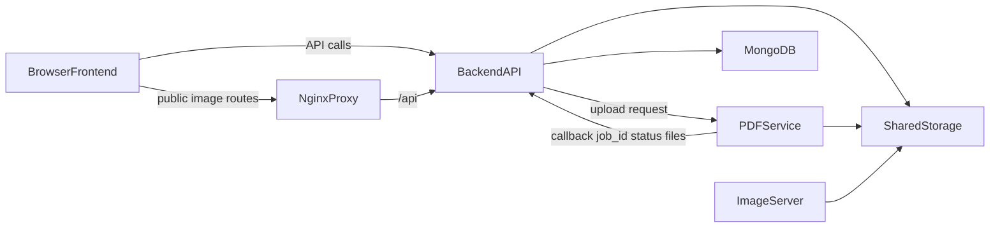

# Reading Pal Architecture

This document describes the current architecture as implemented in the codebase.

## Service Boundaries

## Frontend (`frontend/`)

- React 18 SPA entry: `frontend/src/index.js`
- Route shell and auth token wiring: `frontend/src/App.js`
- Primary pages:
  - `frontend/src/pages/BookList.js`
  - `frontend/src/pages/BookView.js`
  - `frontend/src/pages/LoginPage.js`
  - `frontend/src/pages/AuthCallbackPage.js`
  - `frontend/src/pages/AdminLoginPage.js`
  - `frontend/src/pages/UserManagementPage.js`

Frontend calls backend endpoints under `/api/*` and renders book markdown with image URLs that are rewritten to backend app-image routes.

## Backend API (`backend/`)

- Entry point: `backend/main.py`
- Mounted routers:
  - `/api/auth` -> `backend/api/auth_routes.py`
  - `/api/books` -> `backend/api/books.py`
  - `/api/notes` -> `backend/api/notes.py`
  - `/api/llm` -> `backend/api/llm.py`
  - `/api/bookmarks` -> `backend/api/bookmarks.py`
- Data layer: `backend/db/mongodb.py`
- LLM/service logic:
  - `backend/services/llm_service.py`
  - `backend/services/cleanup_service.py`

Backend is the system-of-record service for user, book, note, bookmark, and reading-guide data.

### Whole-book reading guides

- Up to **5** roadmap instances per book per user in MongoDB collection `reading_guides`, keyed by `(book_id, user_id, guide_id)`.
- Per-guide progress in `reading_guide_progress` (also keyed by `guide_id`).
- Per-card LLM chat threads in `reading_guide_card_chats` (`book_id`, `user_id`, `guide_id`, `card_id`).
- API routes under `/api/books/{book_id}/reading-guides/...` (legacy `/reading-guide` aliases default guide `guide_id=default`).

## Document Service (`pdf_service/`)

- Entry point: `pdf_service/app.py`
- Public API: `POST /process-pdf`
- Internal responsibilities:
  - Detect supported source format (`.pdf`, `.epub`, `.mobi`, `.azw`, `.azw3`, `.docx`, `.txt`, `.html`, `.htm`)
  - Route to format-specific extraction/conversion
  - Determine text PDF vs scanned PDF path for PDF uploads
  - Extract text/images when available
  - Produce markdown output
  - Optionally reformat markdown through configured LLM
  - Callback to backend with processing result payload

## Image Server (`image_server/`)

- Entry point: `image_server/app.py`
- Routes:
  - `GET /images/public/{...}` for public assets
  - `POST /images/upload` for uploads (optional API key auth)
  - `GET /images/app/{...}` and `GET /images/{...}` for localhost-only app/legacy access

In production routing, app images are typically served through backend signed routes rather than direct browser access to `image_server` app endpoints.

## Runtime Architecture

## Request Flows

## Upload and processing flow

1. Frontend uploads a supported ebook/document to `POST /api/books/upload` (backend).
2. Backend forwards the file to `POST {PDF_CLIENT_URL}/process-pdf`.
3. PDF service returns a `job_id` and starts background processing.
4. Backend stores initial book record with `job_id` and pending status.
5. Worker writes markdown/images and calls backend callback `POST /api/books/callback`.
6. Backend updates the matching book by `job_id` with status, markdown filename, and image metadata.

## Book image flow

1. Markdown contains `/images/app/...` references produced during document processing.
2. Frontend rewrites those paths to `/api/books/images/app/...`.
3. Backend signs and validates app-image requests using `APP_IMAGE_SECRET` query parameters (or bearer auth fallback).
4. Backend reads image files from mounted `IMAGES_PATH`.

## Storage Model

Configured in root `.env` and mounted via `docker-compose.yml`:

- `PDF_STORAGE_PATH`: raw uploaded source files (pdf/epub/docx/txt/html/etc.)
- `MARKDOWN_PATH`: generated markdown
- `IMAGES_PATH`: extracted and uploaded images

Backend, PDF service, and image server use container-internal paths that map to the same host directories.

## Key Architecture Constraints

- Backend runs with `network_mode: host`, so callback and local URLs must account for host networking.
- PDF service is asynchronous by design; frontend must poll processing status.
- Browsers do not include bearer token headers on plain markdown image fetches, so signed URLs are required for protected app-image delivery.
- MongoDB is external to this compose file and must be reachable from containers using the configured URI.
